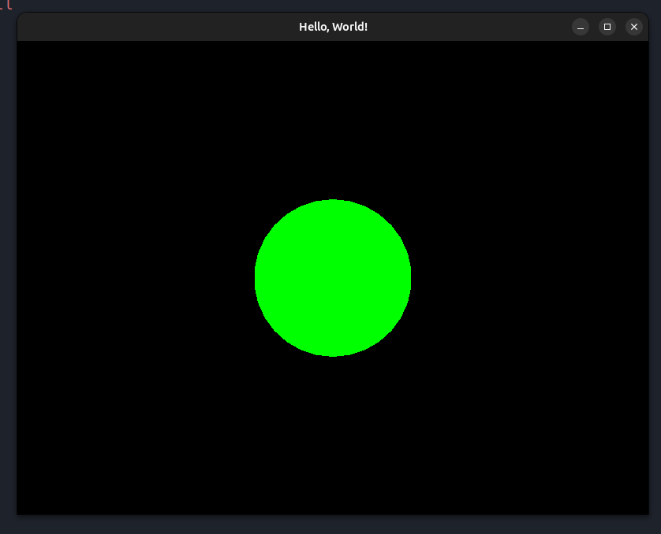

# smfl_linux

Play Around with smfl on Linux (Ubuntu)

## What is this?

Ein simples Programm, was ein Fenster erstellt und einen Kreis in die Mitte zeichnet.


## Use


```bash
git clone https://github.com/Toby-Fm/smfl_linux_template.git
cd smfl_linux_template
```

```bash
make linux-install
make
./main
```
